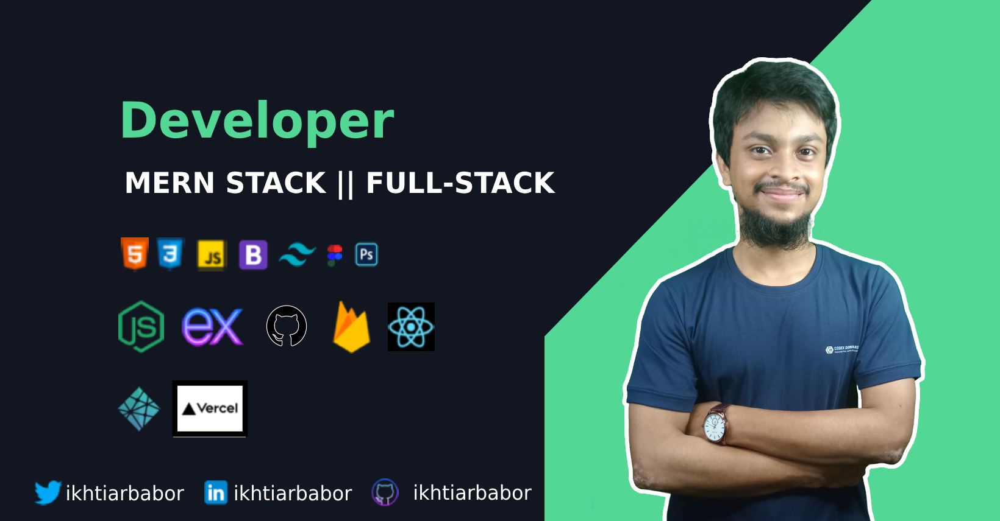

<h1 align="center">Hi 👋, I'm MOHAMMAD IKHTIAR UDDIN</h1>
<h3 align="center">A Junior MERN Stack Developer ||Full Stack Developer</h3> 

**Hello there! I'm Mohammad Ikhtiar Uddin, a passionate MERN stack developer eager to expand my knowledge and skills in web development. I am dedicated, hardworking, and always excited to learn new technologies and frameworks. With expertise in HTML, CSS, React, Bootstrap, React Bootstrap, and Tailwind CSS, I strive to create visually appealing and user-friendly web applications.**

 &emsp;Connect with me!

    

- 📄 Know about my experiences [https://drive.google.com/file/d/1Px_N9eLM9sK4ryRqenwWXezqYOh2kXy4/view](https://drive.google.com/file/d/1Px_N9eLM9sK4ryRqenwWXezqYOh2kXy4/view)

  

  

<h3 align="left">Languages and Tools:</h3>

              

&nbsp;

